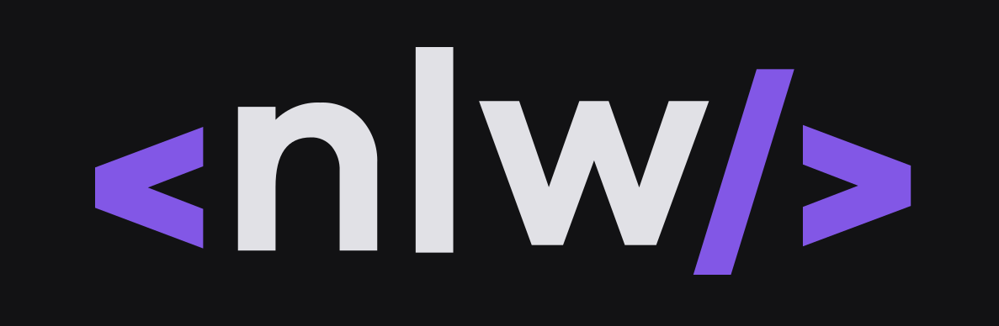
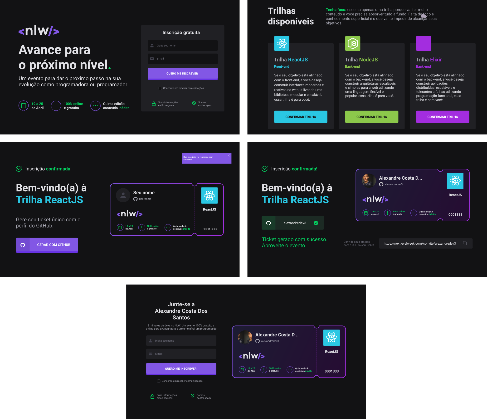

<h1 align="center">
  
  <br />
  <a href="https://www.linkedin.com/in/alexandre-costa-401699199">
    
  </a>
  <a href="https://github.com/alexandredev3/nlw-app-clone/blob/master/LICENSE.txt">
    
  </a>
  <a href="https://github.com/alexandredev3/nlw-app-clone/issues">
    
  </a>
  <a href="https://github.com/alexandredev3/nlw-app-clone/issues?q=is%3Aissue+is%3Aclosed">
    
  </a>
  <a href="https://github.com/alexandredev3/nlw-app-clone/network">
    
  </a>
  <a href="https://github.com/alexandredev3/nlw-app-clone/stargazers">
    
  </a>
</h1>
<p align="center">
  <a href="#page_facing_up-descrição">Descrição</a>&nbsp;&nbsp;&nbsp;|&nbsp;&nbsp;&nbsp;
  <a href="#art-Layout">Layout</a>&nbsp;&nbsp;&nbsp;|&nbsp;&nbsp;&nbsp;
  <a href="#-tecnologias">Tecnologias</a>&nbsp;&nbsp;&nbsp;|&nbsp;&nbsp;&nbsp;
  <a href="#clipboard-Funcionalidades">Funcionalidades</a>&nbsp;&nbsp;&nbsp;|&nbsp;&nbsp;&nbsp;
  <a href="#closed_book-instalação">Instalação</a>&nbsp;&nbsp;&nbsp;|&nbsp;&nbsp;&nbsp;
  <a href="#man-Autor">Autor</a>&nbsp;&nbsp;&nbsp;|&nbsp;&nbsp;&nbsp;
  <a href="#memo-Licença">Licença</a>
</p>



## :page_facing_up: Descrição
Um evento para dar o próximo passo na sua evolução como programadora ou programador.

## :art: Layout
Você pode acessar o Layout pelo <a href="https://www.figma.com">Figma<a> atravês <a href="https://www.figma.com/file/Y7OdHX7Ovces7cKIezRR7c/Next-Level-Week">desse link<a>.

## 🛠 Tecnologias
Este projeto foi desenvolvido com as seguintes tecnologias

- [Next.js](https://nextjs.org/)
- [React.js](https://pt-br.reactjs.org/)
- [TypeScript](https://www.typescriptlang.org/)
- [ChakraUI](http://chakra-ui.com/getting-started)
- [FaunaDB](https://fauna.com/)
- [Firebase](https://firebase.google.com/)
- [Formik](https://formik.org/)
- [Yup](https://github.com/jquense/yup)

## :clipboard: Funcionalidades
- [x] Fazer inscrição.
- [x] Escolher uma trilha.
- [x] Fazer login com o github para gerar um convite.


## :closed_book: Instalação

### Pré-requisitos
Antes de começar, você vai precisar ter instalado em sua máquina as seguintes ferramentas:
[Git](https://git-scm.com), [Node.js](https://nodejs.org/en/), Além disto é bom ter um editor para trabalhar com o código como [VSCode](https://code.visualstudio.com/)

Não se esqueça de preencher as variaveis de ambiente no arquivo ```.env.development```, todas os nomes das variaveis que você precisa usar estão no ```.env.example```, eu deixei a ```PUBLIC_KEY``` e o ```PRIVATE_KEY``` no diretório ```/src/static``` para gerar o token.

```bash
# Clone este repositório.
$ git clone https://github.com/alexandredev3/nlw-app-clone.git

# Vá para a pasta nlw-app-clone
$ cd nlw-app-clone

# Instale as dependências
$ npm install 

# Execute aplicação
$ npm run dev

# O app vai está rodando na porta 3000 - acesse <http://localhost:3000>
```

## :man: Autor

<a href="https://github.com/alexandredev3/">
 
 <br />
 <sub><b>Alexandre Costa</b></sub>
</a>


Feito com ❤️ por Alexandre Costa :wave::wave: Entre em contato!🚀

<a href="https://www.linkedin.com/in/alexandre-costa-dos-santos">
  
</a>


## :memo: Licença

Copyright © 2020 [Alexandre Costa](https://github.com/alexandredev3).<br />
This project is [MIT](./LICENSE.txt) licensed.
